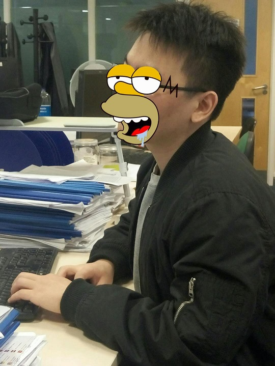

[TOC]

# 简介/Short BIO.

欢迎来到**常晓斌**的主页，他目前在[中山大学](http://www.sysu.edu.cn/cn/index.htm)[人工智能学院](http://sai.sysu.edu.cn/)任副教授。

- 电子邮箱(Email)：_changxb3\_at\_mail.sysu.edu.cn_
- [姬哈(Github)](https://github.com/xb-chang)
- [Google Scholar](https://scholar.google.com/citations?user=nDS74T4AAAAJ&hl=en)

Welcome! This is **Xiaobin Chang**'s Homepage. He is an Assistant Professor at [School of Artificial Intelligence](http://sai.sysu.edu.cn/), [Sun Yat-sen University](http://www.sysu.edu.cn/cn/index.htm). He was a postdoc researcher of [Simon Fraser University](https://www.sfu.ca/) and work with Professor [Greg Mori](https://www.cs.sfu.ca/~mori/). He got Ph.D. degree from [Queen Mary University of London](http://www.qmul.ac.uk/), under the guidance of Professor [Tao Xiang](http://personal.ee.surrey.ac.uk/Personal/T.Xiang/index.html) and [Timothy Hospedales](http://homepages.inf.ed.ac.uk/thospeda/). His Master advisor was Professor [Wei-Shi Zheng](http://isee.sysu.edu.cn/~zhwshi/) at Sun Yat-sen University. His research interests including: __Computer Vision__ (e.g., Action Analysis and Representation Learning) & __Machine Learning__ (e.g., Temporal Information Porcessing and Multi-View Problems)

# 消息/News

- _2023/03_ 恭喜毋超 (ICASSP'24)，刘峰 (CVMJ)，高湛欣 (CVPR'24)的文章被接收，Well Done!
- _2023/09_ [第三届计图人工智能挑战赛](https://www.educoder.net/competitions/Jittor-4)图片生成赛道**第一名**，刘峰，Well Done!
- _2023/09_ 欢迎两位硕士研究生：刘璇、姚重任
- _2023/07_ One ICCV paper accepted. Xiuwei (陈修伟), Congratulation!
- _2022/09_ 欢迎两位硕士研究生：刘峰、罗涵
- _2022/03_ One CVPR paper accepted. Chao (毋超), Congratulation!

# 招生

我的研究领域主要是[计算机视觉(Computer Vision)](https://en.wikipedia.org/wiki/Computervision)和[机器学习(Machine Learning)](https://en.wikipedia.org/wiki/Machine_learning)，过往的研究侧重于利用机器学习的方法来分析图像中的人物及其相关信息，现在还对[持续学习](https://www.continualai.org/)和AIGC(如[扩散模型](https://en.wikipedia.org/wiki/Diffusion_model))相关研究方向感兴趣。欢迎联系和咨询__硕士研究生__相关事宜，也欢迎有意愿提前进入本实验室的__本科生__联系。
联系方式：_changxb3\_at\_mail.sysu.edu.cn_；

## 在读硕士

- [毋超](https://ftd-wuchao.github.io/)
- [陈修伟](https://chen-xiuwei.github.io/)
- [林涛](https://lint39.github.io/)
- [高湛欣](https://github.com/Zhanxin-Gao)
- [刘峰](https://ader47.github.io/)
- [罗涵](https://luoh226.github.io/)
- [刘璇](https://scarlet0703.github.io)
- [姚重任](https://github.com/yzr939)

# Selected Publications

**Consistent Prompting for Rehearsal-Free Continual Learning.**
Zhanxin Gao, Jun Cen, ***Xiaobin Chang\****.
CVPR, 2024. [[PDF](https://arxiv.org/abs/2403.08568)] [[Code](https://github.com/Zhanxin-Gao/CPrompt)] [[Bibtex](./src/bibtex/CPrompt_CVPR24.txt)]

**IIDM: Image-to-Image Diffusion Model for Semantic Image Synthesis.**
Feng Liu, ***Xiaobin Chang\****.
Computational Visual Media Journal (CVMJ), 2024. [[PDF](https://arxiv.org/abs/2403.13378)] [[Code](https://github.com/ader47/jittor-jieke-semantic_images_synthesis)] [[Bibtex](./src/bibtex/IIDM_CVMJ24.txt)]

**Generalizable Two-Branch Framework for Image Class-Incremental Learning.**
Chao Wu, ***Xiaobin Chang\****, Ruixuan Wang.
ICASSP, 2024. [[PDF](https://arxiv.org/abs/2402.18086)] [[Code](https://github.com/ftd-Wuchao/G2B)] [[Bibtex](./src/bibtex/G2B_ICASSP24.txt)]

**Dynamic Residual Classifier for Class Incremental Learning.**
Xiuwei Chen, ***Xiaobin Chang\****.
ICCV, 2023. [[PDF](https://openaccess.thecvf.com/content/ICCV2023/papers/Chen_Dynamic_Residual_Classifier_for_Class_Incremental_Learning_ICCV_2023_paper.pdf)] [[Code](https://github.com/chen-xw/DRC-CIL)] [[Bibtex](./src/bibtex/DRCCIL_ICCV23.txt)]

**Camera-Conditioned Stable Feature Generation for Isolated Camera Supervised Person Re-IDentification.**
Chao Wu, Wenhang Ge, Ancong Wu, ***Xiaobin Chang\****.
CVPR, 2022. [[PDF](https://arxiv.org/abs/2203.15210)] [[Code](https://github.com/ftd-Wuchao/CCSFG)] [[Bibtex](./src/bibtex/StableVAE_CVPR22.txt)]

**Learning Discriminative Prototypes with Dynamic Time Warping**.
_**Xiaobin Chang**_, Frederick Tung, Greg Mori.
CVPR, 2021. [[PDF](https://arxiv.org/pdf/2103.09458)] [[Code](https://github.com/BorealisAI/TSC-Disc-Proto)] [[Bibtex](./src/bibtex/DPDTW_CVPR21.txt)]

**Disjoint Label Space Transfer Learning with Common Factorised Space**.
_**Xiaobin Chang**_, Yongxin Yang, Tao Xiang, Timothy M. Hospedales.
AAAI, 2019. [[PDF](http://arxiv.org/abs/1812.02605)] [[Bibtex](./src/bibtex/CFS_AAAI19.txt)]

**Multi-Level Factorisation Net for Person Re-Identification**.
_**Xiaobin Chang**_, Timothy M. Hospedales, Tao Xiang.
CVPR, 2018. [[PDF](https://arxiv.org/abs/1803.09132)] [[Bibtex](./src/bibtex/MLFN_CVPR18.txt)]

**Scalable and Effective Deep CCA via Soft Decorrelation**.
_**Xiaobin Chang**_, Tao Xiang, Timothy M Hospedales.
CVPR, 2018. [[PDF](https://arxiv.org/abs/1707.09669)] [[Bibtex](./src/bibtex/DeepDeCorr_CVPR18.txt)]

**The Devil is in the Middle: Exploiting Mid-level Representations for Cross-Domain Instance Matching**.
Qian Yu, _**Xiaobin Chang**_, Yi-Zhe Song, Tao Xiang, Timothy M Hospedales.
arXiv, 2017. [[PDF](https://arxiv.org/abs/1711.08106)] [[Bibtex](./src/bibtex/DevilMid_arxiv17.txt)]

**Deep Multi-View Learning with Stochastic Decorrelation Loss**.
_**Xiaobin Chang**_, Tao Xiang, Timothy M Hospedales.
arXiv, 2017. [[PDF](https://arxiv.org/abs/1707.09669)] [[Bibtex](./src/bibtex/DeepDeCorr_CVPR18.txt)]

**L1 Graph Based Sparse Model for Label De-noising**.
_**Xiaobin Chang**_, Tao Xiang, Timothy M Hospedales.
BMVC *Oral*, 2016. [[PDF](http://homepages.inf.ed.ac.uk/thospeda/papers/chang2016robustDenoise.pdf)] [[Bibtex](./src/bibtex/L1Denoise_BMVC16.txt)]

**Facial skin beautification via sparse representation over learned layer dictionary**.
Xi Lu, _**Xiaobin Chang**_, Xiaohua Xie, Jian-Fang Hu, Wei-Shi Zheng.
IJCNN, 2016. [[PDF](http://ieeexplore.ieee.org/stamp/stamp.jsp?arnumber=7727515)] [[Bibtex](./src/bibtex/FaceBeau_IJCNN16.txt)]

**Learning person–person interaction in collective activity recognition**.
_**Xiaobin Chang**_, Wei-Shi Zheng, Jianguo Zhang.
IEEE Transactions on Image Processing, 2015. [[PDF](http://ieeexplore.ieee.org/stamp/stamp.jsp?arnumber=7055886)] [[Bibtex](./src/bibtex/CollectActivity_TIP15.txt)]

# 教学/Teaching

1. 离散数学/Discrete Math （本科课程）

2. 机器学习/Machine Learning（研究生课程）

# I love BUGs, Really.

“*他那时候还太年轻，不知道所有熬的夜，早已在暗中标好了价格。*”

